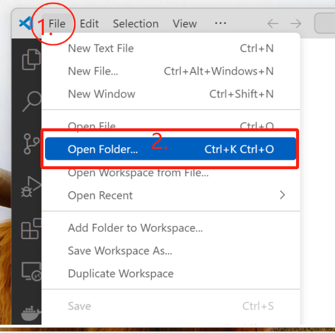
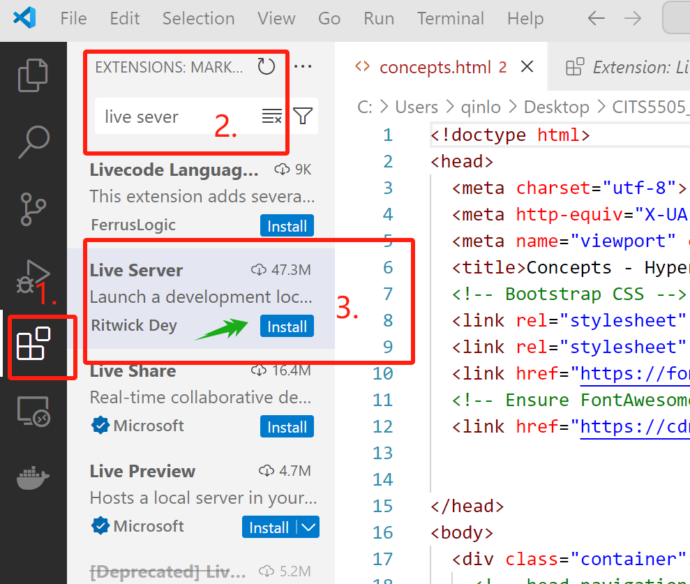
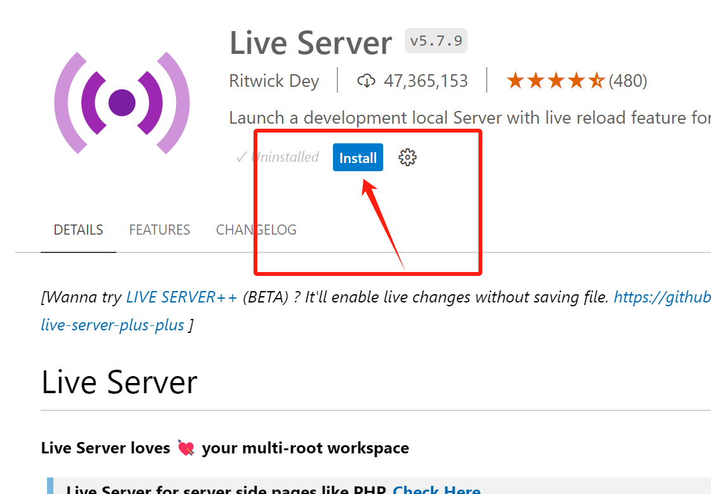

# CITS5505 WEB Project 1 Overview

## Project Description

In `Project 1 CITS5505`, I developed a dynamic website consisting of three main pages: **Concept**, **History**, and **CV**. 
## Technology Stack
The website was built using the following technologies:
- **HTML**: Structured the basic layout and content of the web pages.
- **CSS**: Styled the website to improve visual appeal.
- **JavaScript**: Added interactivity to the web pages.
- **Bootstrap**: Utilized for responsive design to ensure the site looks good on all devices.
- **jQuery**: Simplified DOM manipulation, event handling, and AJAX calls.
- **AJAX**: Enabled asynchronous data requests without refreshing the web page, enhancing user experience.
---

# Installing and Using **`Live Server`** in Visual Studio Code

Live Server is a handy extension for Visual Studio Code that allows you to launch a local development server with a live reload feature for static and dynamic pages.

## Step 0: Open Visual Studio Code and the CITS5505 Project 1 fold

First, ensure that Visual Studio Code is installed on your computer. Open Visual Studio Code to begin the setup.

## Step 1: Access the Extensions Panel

Click on the extensions icon on the sidebar or press `Ctrl+Shift+X` to open the Extensions panel.

## Then: Search for Live Server

In the Extensions panel, type "Live Server" into the search bar. You'll see a list of available extensions related to your search.

## Step 2: Install Live Server

Find the Live Server extension by Ritwick Dey (it should be the top result if it's popular). Click on the green "Install" button to install the extension.

## Step 3: Start Live Server

Right-click on your HTML file in the file explorer and select "Open with Live Server" or click on the "Go Live" button in the bottom right corner of the status bar to launch your site on a local server.

## Using Live Server

Once Live Server is running, any changes the HTML, CSS, or JavaScript files will automatically trigger a reload in the browser. This feature allows us to see updates in real time without manually refreshing your browser.

---
### Thank you for reviewing my code!

